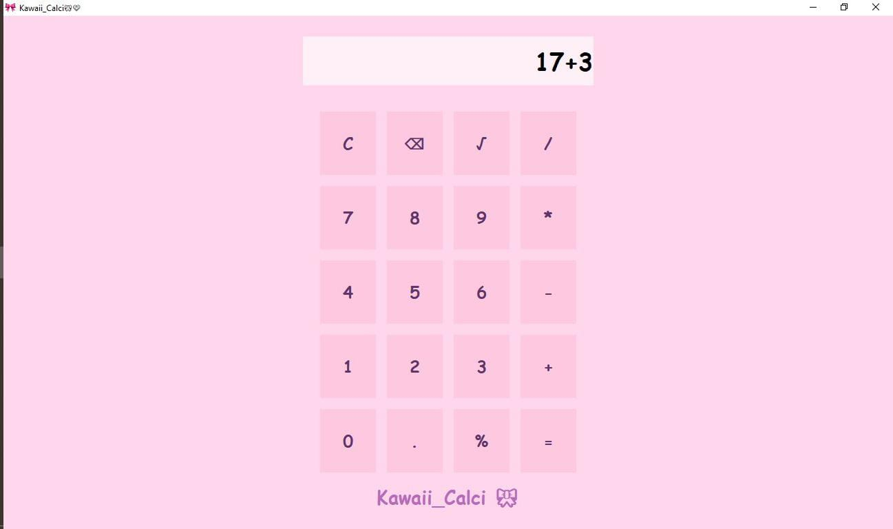

# 🎀 Kawaii_Calci ✨


A soft baby-pink aesthetic calculator app made with Python 🧁💗  
Created with Tkinter — simple, minimal, and totally adorable 💫  

## 💖 Features
- Cute UI with pastel theme 🌸  
- Functional basic calculator  
- “Clear” button to erase mistakes 🧽  
- Custom icon support 💎 

## 🪄 Run the app
```bash
python kawaii_calci.py
